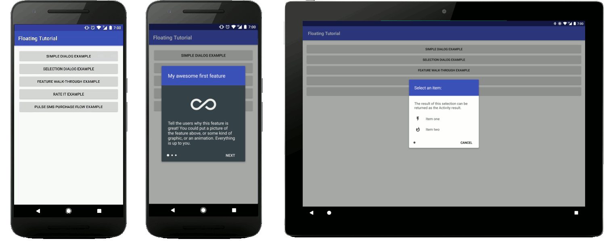

# Android Floating Tutorial Activity

This README discusses the usage of the tutorial in **Java** rather than **Kotlin**, which is demonstrated in the [README.md](README.md).

## Usage

You will need to create a new `Activity` that extends `FloatingTutorialActivity` and implements the `FloatingTutorialActivity#getPages` function:

```java
public class ExampleActivity extends FloatingTutorialActivity {
    @Override
    public List<TutorialPage> getPages() {
        return new ArrayList<TutorialPage>();
    }
}
```

That function will return the list of pages that the user will see. The simplest implementation of providing a page would look like this:

```java
@Override
public List<TutorialPage> getPages() {
    List<TutorialPage> pages = new ArrayList<>();

    pages.add(new TutorialPage(this) {
        @Override
        public void initPage() {
            setContentView(R.layout.simple_layout);
        }
    });

    return pages;
}
```

A `TutorialPage` is similar to an `Activity` or `Fragment`. After you have used the `setContentView` function, you can manipulate those `Views` with the `findViewById` method. The tutorial pages do not enforce any UI standards for the content, so you can design these layouts to be whatever you want. Each page will automatically get the "Next" button and the progress indicators added, unless you specifically remove them.

To customize the look of the page, there are numerous options available:

```java
new TutorialPage(context) {
    @Override
    public void initPage() {
        // set the layout for the individual page
        setContentView(R.layout.simple_layout);

        // manipulate views however you want
        View view = findViewById(R.id.example_view)
        view.setBackgroundColor(Color.RED)
        view.setOnClickListener(...)

        // Customize the look of the page
        hideNextButton();                          // useful if you want to handle going to the next page, within your layout, instead of with this button
        setNextButtonColor(Color.WHITE);           // you can also provide a color resource value with the setNextButtonColorResource function
        setNextButtonText("New Text");             // you can also provide a string resource value
        setProgressIndicatorColor(Color.WHITE);    // you can also provide a color resource value with the setProgressIndicatorColorResource function
        setBackgroundColor(Color.BLACK);           // the default background color is white. Changing it here will automatically adjust the progress indicator and next button colors, based on whether or not the background is light or dark.
    }
})
```

Any other customization you want can come directly from your layout file. My examples show the primary color for the background of the top text. You could do that inside of your layout, if you like that look.

### Animating the layouts


In my examples, as well as my own usage of this library, I like to provide subtle animations the first time that a user views a `TutorialPage`. If they were to go backwards in the tutorial, then return to a page for a second time, I do not show the animation again. If you would like to animate your pages in this way, you can override the `TutorialPage#animateLayout` function.

```java
new TutorialPage(context) {
    ...

    @Override
    public void animateLayout() {
        View view = findViewById(R.id.example_view);

        // do some animation here. I have an example animation that you could use:
        // https://github.com/klinker24/Android-FloatingTutorialActivity/blob/master/sample-java/src/main/java/xyz/klinker/floating_tutorial/util/AnimationHelper.java
        AnimationHelper.quickViewReveal(view, 300);
    }
});
```

If you would rather animate the `View` every time the page is shown, you could override the `TutorialPage#onShown(firstTimeShown: Boolean)` method, instead. If you override that, be sure to call the super class method.

### Providing results from the individual pages, or the entire tutorial

Sometimes, you may need to have some state in your tutorial. If you are using the tutorial to log in a user, for example, you will probably need the calling `Activity` to know if the login was successful or not.

For an example of how to provide an `Activity` result from your `TutorialPage`, please see the [SelectionDialogExample](sample-java/src/main/java/xyz/klinker/floating_tutorial/examples/SelectionDialogExample.java).

Other times, you may need to know the result of the previous page, to display the UI for the next page. In the [RateItExample](sample-java/src/main/java/xyz/klinker/floating_tutorial/examples/RateItExample.java), the first page asks the user to give a thumbs up or thumbs down.

* If the user selects thumbs down, the second page will ask them if they want to provide feedback.
* If the user selects thumbs up, the second page will ask them if they want to rate the app on the Play Store.

This is a good example of the need to communicate the previous page's result to the current page, and customizing the current page, based on that result.

## Examples Explained

The sample app comes with a few different examples, highlighting different functionality:

* [SimpleDialogExample](sample-java/src/main/java/xyz/klinker/floating_tutorial/examples/SimpleDialogExample.java): a quick and nice looking replacement for an alert dialog, if you want it. This demonstrates a single page and some of the animation capabilites.
* [SelectionDialogExample](sample-java/src/main/java/xyz/klinker/floating_tutorial/examples/SelectionDialogExample.java): this demonstrates a selection process. It will provide the selection result as the `Activity` result.
* [FeatureWalkthroughExample](sample-java/src/main/java/xyz/klinker/floating_tutorial/examples/FeatureWalkthroughExample.java): this is a simple feature tutorial that could be used anywhere in your apps. It also demonstrates changing the background color and providing multiple pages.
* [RateItExample](sample-java/src/main/java/xyz/klinker/floating_tutorial/examples/RateItExample.java): as discussed above, this example demonstrates passing data between the current and the previous page and manipulating the page, based on that data.
* [PulseSmsPurchaseExample](sample-java/src/main/java/xyz/klinker/floating_tutorial/examples/PulseSmsPurchaseExample.java): this demonstrates one way that I have used the `floating-tutorial` in [Pulse SMS](https://play.google.com/store/apps/details?id=xyz.klinker.messenger). It demonstrates more complex layouts and animations, as well as an `Activity` result.

## License

    Copyright 2017 Luke Klinker

    Licensed under the Apache License, Version 2.0 (the "License");
    you may not use this file except in compliance with the License.
    You may obtain a copy of the License at

       http://www.apache.org/licenses/LICENSE-2.0

    Unless required by applicable law or agreed to in writing, software
    distributed under the License is distributed on an "AS IS" BASIS,
    WITHOUT WARRANTIES OR CONDITIONS OF ANY KIND, either express or implied.
    See the License for the specific language governing permissions and
    limitations under the License.
